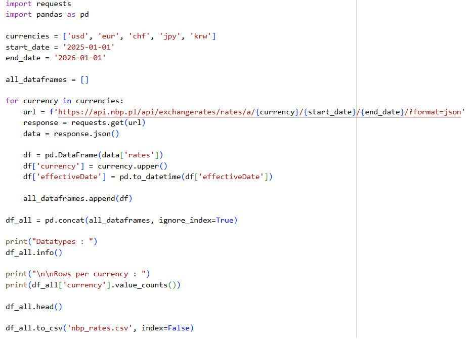
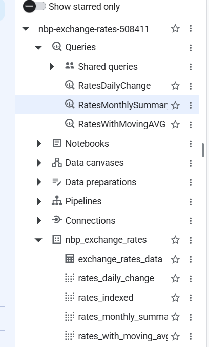
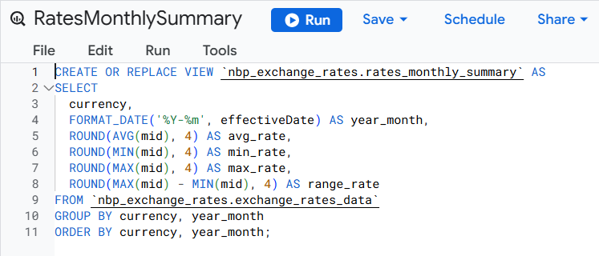
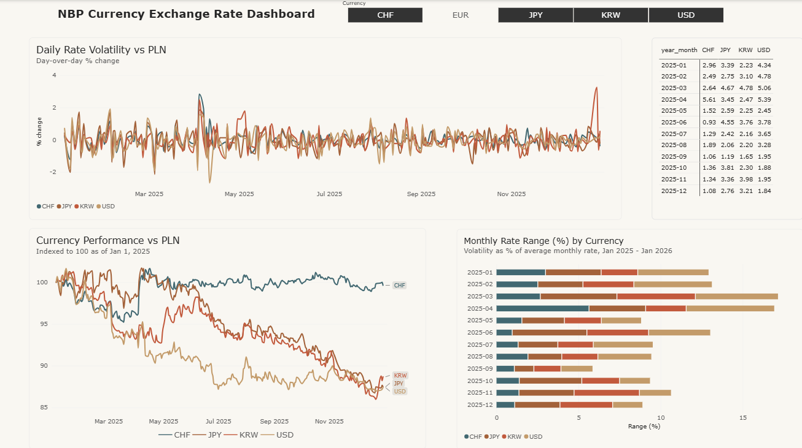

# NBP Currency Exchange Rate Dashboard

End-to-end data pipeline analyzing PLN exchange rates against five currencies (USD, EUR, CHF, JPY, KRW), from raw API data to an interactive Power BI dashboard.

## Data Source

[National Bank of Poland (NBP) API](https://api.nbp.pl) - public, no authentication required. Table A exchange rates, daily frequency, Jan 2025 - Jan 2026.

## Pipeline

**1. Data extraction (Python, Google Colab)**
Fetched daily rates per currency via `requests`, combined into a single tidy dataframe with `pandas`, exported as CSV.



**2. Storage (Google BigQuery)**
Raw CSV uploaded to BigQuery. Four SQL views built on top of the raw table for downstream analysis.



**3. Transformation (SQL)**
Views created using window functions (`FIRST_VALUE`, `LAG`, `AVG OVER`):

- `rates_with_moving_avg` - 7-day and 30-day moving averages
- `rates_daily_change` - day-over-day % change
- `rates_indexed` - all currencies rebased to 100 (Jan 1, 2025), for cross-currency comparability despite differing unit values
- `rates_monthly_summary` - monthly avg/min/max/range, range expressed as % of average rate



**4. Visualization (Power BI)**
Connected directly to the BigQuery views. Dashboard includes:

- Currency performance vs PLN (indexed trend)
- Daily rate volatility
- Monthly volatility range by currency
- Interactive currency filter across all visuals



## Key Insight

CHF and EUR remained relatively stable against PLN throughout 2025, while USD, JPY, and KRW depreciated by roughly 12-13% - consistent with broader USD weakness observed globally that year.

## Used Technology

Python (pandas, requests) - Google BigQuery - SQL (window functions) - Power BI

## Repository Structure

```
├── scripts/          # Python data extraction script + csv result file
├── sql/              # SQL view definitions
├── dashboard/        # Power BI (.pbix) file
├── screenshots/      # Pipeline and dashboard screenshots
└── README.md
```
